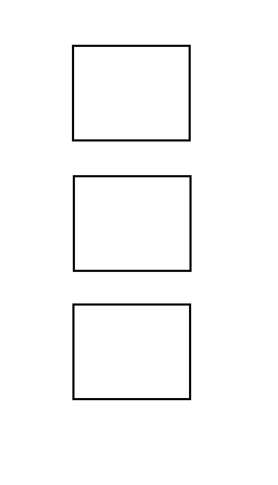
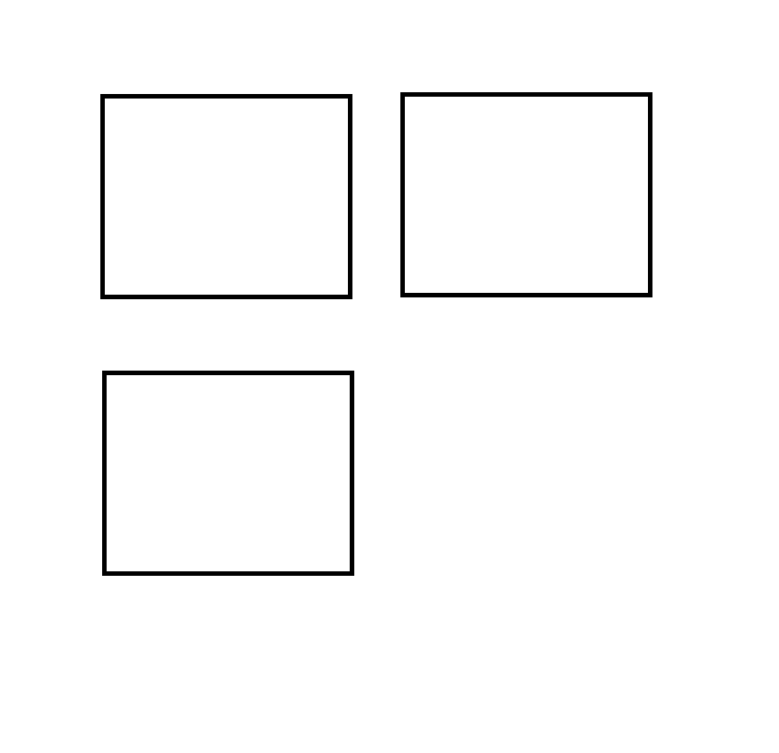
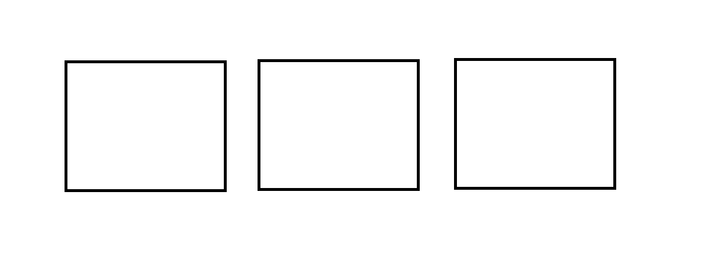

# Class Notes

## Google fonts
You can use a link to the google fonts or download google fonts. If you download a google font it will be a ttf file. You can use fontsquirrel.com/tools/webfont-generator to convert it to a woff file which is a file type that we can use.

## Design Principles
- You will need to pick 3 of these for your homework this week.
- You wll need to use grid and show examples of each of the three principles chosen. Take a screenshot in mobile version.
- You will have a mobile main.css, a medium.css, and finally a large.css

### Mobile main.css
This will be the larges file.

### Medium medium.css
This will be the larges file.

### Large large.css
This will be the larges file.

