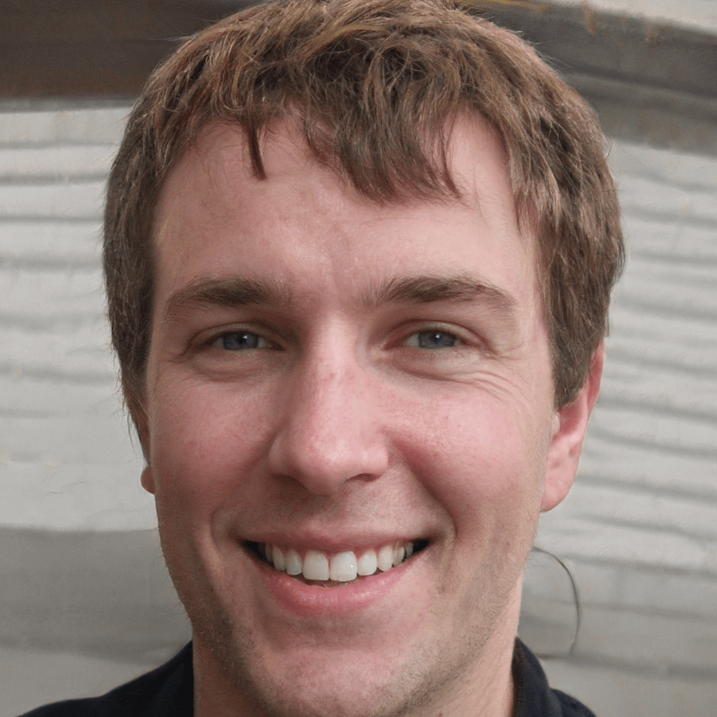

## Mission:
Our mission is to grow our community and to bring more people to a more uplifting mindset through nature.

## Purpose:
Rocksberg city is perfect for outdoor focused business starters who want to bring people closer to nature and all people looking for great outdoor activities who want to bring people closer to nature. We know how stressful work life can be and how import it is to be able to relax. Rocksberg is a beautiful gem with beautiful scenearies. Since 1960 we have been helping people grow closer to themselves by growing closer to nature and that is our goal.

### Persona 1:

Brock Jones
Is a hard worker, maybe too hard working and doesn't relax enough getting him to stess.

Places to go rock climbing: In Rocksberg county park got to trail 45, trail 32, and trails 4-15.
Camping sites
White water rafting
Tour companies
City activies


### Persona 2:

Sarah Smith
Is an entrepreneur looking for a place to set up her business.

City attractions
Local scenary
Local businesses
Business locations
City business guidlines and requirements

rocksbergcity.com


### Fonts

- Varela Round
- Rubik Dirt

```css
@import url(
    'https://fonts.googleapis.com/css2?family=Rubik+Dirt&family=Varela+Round&display=swap'
    );

element {
    font-family: 'Rubik Dirt', cursive;
    font-family: 'Varela Round', sans-serif;
}
```